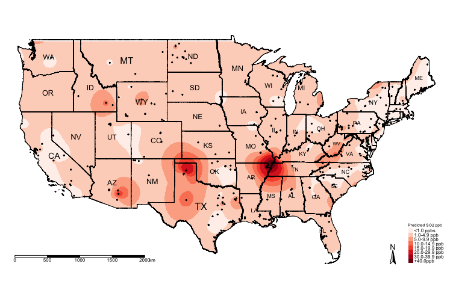

<style type: "text/css">
h1.title {
	font-size: 20px;
}

h4.date {
	font-size: 18px;
}

h1 {
	font-size: 18px;
}

h2 {
	font-size: 18px;
}

body{/* Normal */
	font-size: 13px;
	text-align: justify;
}

p.comment {
background-color: #DBDBDB;
padding: 10px;
border: 1px solid black;
border-radius: 5px;
}

code.r{
  font-size: 10px;
}
pre {
  font-size: 12px
}
</style>

<hr style="border:2px solid gray"> </hr>

```{r setup, include = FALSE}
knitr::opts_knit$set(root.dir = "/Users/anwarmusah/Documents/GITHUB/GEOG0114-PSA-WK6-1/Dataset")
knitr::opts_chunk$set(cache = TRUE)
```

```{r, include = FALSE}
library("gstat")
library("sf")
library("tmap")
library("raster")
library("sp")
```

## **3.1. Building the Raster Template**
Let us create a template raster for interpolation. The extent of the raster template should based on the points. We are going
to make the resolution of grid be at 5000m by 5000m (5km by 5km) accordingly.

```{r eval=FALSE}
RasterTemplate <- raster(datafile_sp_prj)
res(RasterTemplate) <- 5000
```

Next, declare template as a spatial grid
```{r, eval=FALSE}
grid.interpolation <- as(RasterTemplate, 'SpatialGrid')
```

## **3.2. Spatial Interpolation using Kriging**
Now, we are going to use the parameters from the exponential theoretical semivariogram model to interpolate the concentrations of ambient SO2 for the entire study region

```{r, eval=FALSE}
modelKrigingExp <- gstat(formula = Mean_SO2~1, locations = datafile_sp_prj, model = exp_SO2_emp.variogram)
```

The results are stored in `modelKrigingExp` object. Lets add the results of the interpolation to our grid template using the 
`predict()` function

```{r, eval=FALSE}
# this may take roughly 5mins
Kriged_SO2 <- predict(modelKrigingExp, grid.interpolation)
```

The above analysis produces two separate rasters: i.) Predicted $SO_{2}$ and ii.) Variation in $SO_{2}$. Let export the results and make some visualisation using the `tmap` functions

## **3.3. Export the results as .tiff format and Thematic visualisation in** `tmap`
Save both the prediction and variance a multi-layer raster (a 'brick' raster):

```{r, eval=FALSE}
brickedKriged_SO2_Results <- brick(Kriged_SO2)
```

We can save them individually from the multi-layer raster as follows:
```{r, eval=FALSE}
# Separate the rasters accordingly
exp.prediction <- raster(brickedKriged_SO2_Results, layer = 1)
exp.variance <- raster(brickedKriged_SO2_Results, layer = 2)
#  save the output locally on your computer
writeRaster(exp.prediction, "Predicted SO2 levels in USA.tif", format="GTiff", overwrite = TRUE)
writeRaster(exp.variance, "Variance SO2 levels in USA.tif", format="GTiff", overwrite = TRUE)
```

Let us visualise the predictions:
```{r, eval=FALSE}
# mask values of raster outside regions of US Border
exp.prediction_masked <- mask(exp.prediction, US_Nation_Border_sp_shp)

tm_shape(US_Nation_Border_shp) + tm_polygons(alpha = 0, border.col = "black") + # add base map of borders here
	tm_shape(exp.prediction_masked) + tm_raster(title = "Predicted SO2 ppb", style = "cont", palette = "Reds") +
	tm_shape(US_State_Borders_shp) + tm_polygons(alpha = 0, border.col = "black") +
	tm_text("STUSPS", size = "AREA") +
	tm_shape(datafile_sf_prj) + tm_dots() + 
	tm_scale_bar(position = c("left","bottom")) +
	tm_compass(position = c("right", "bottom")) +
	tm_layout(frame = FALSE, legend.title.size = 0.5, legend.text.size = 0.5)
```

<center>

</center>

The above shows the predicted concentrations of ambient $SO_{2}$; however, the predicted surface is very smooth and it difficult
to see the spatial patterns. One technique, which is sometimes useful, for raster data is to reclassify the pixels to zones instead
of pixel-point estimates.

We could reclassify the continuous values stored in the grids/pixels into discrete values using the following scheme:
- 0 = `"< 1.0 ppb"`
- 1 = `"1.0-4.9 ppb"`
- 2 = `"5.0-9.9 ppb"`
- 3 = `"10.0-14.9 ppb"`
- 4 = `"15.0-19.9 ppb"`
- 5 = `"20.0-29.9 ppb"`
- 6 = `"30.0-39.9 ppb"`
- 7 = `"+40.0 ppb"`

You can do this by using following code:

```{r, message=FALSE, warning=FALSE}
# Create a vector for the reclassification -i.e., 1st row captures values between 0 and below 1 to reclassify a pixel as 0
# the 2nd row in this vector captures values between 1 and below 5 to reclassify a pixel as 1 and so on and so forth
reclassifyRaster <- c(0,1,0,
1,5,1,
5,10,2,
10,15,3,
15,20,4,
20,30,5,
30,40,6,
40,70,7)

# Then store the values into a matrix 
reclassifyRaster_Mat <- matrix(reclassifyRaster, ncol=3, byrow=TRUE)
reclassifyRaster_Mat
```

Now, apply the matrix to the raster object to reclassify the pixels accordingly using the `reclassify()` function:
```{r, eval=FALSE}
exp.prediction_masked_rec <- reclassify(exp.prediction_masked, reclassifyRaster_Mat)
```

Now, lets visualise the zones:
```{r, eval=FALSE}
tm_shape(US_Nation_Border_shp) + tm_polygons(alpha = 0, border.col = "black") + # add base map of borders here
	tm_shape(exp.prediction_masked_rec) + tm_raster(title = "Predicted SO2 ppb", style = "cat", palette = "Reds", 
					 labels = c("<1.0 ppbs","1.0-4.9 ppb","5.0-9.9 ppb", "10.0-14.9 ppb" , "15.0-19.9 ppb", "20.0-29.9 ppb", "30.0-39.9 ppb","+40.0ppb")) +
	tm_shape(US_State_Borders_shp) + tm_polygons(alpha = 0, border.col = "black") +
	tm_text("STUSPS", size = "AREA") +
	tm_shape(datafile_sf_prj) + tm_dots() + 
	tm_scale_bar(position = c("left","bottom")) +
	tm_compass(position = c("right", "bottom")) +
	tm_layout(frame = FALSE, legend.title.size = 0.5, legend.text.size = 0.5)
```

<center>

</center>

You can visualise the variance:
```{r, eval=FALSE}
# mask values of raster outside regions of US Border
exp.variance_masked <- mask(exp.variance, US_Nation_Border_sp_shp)

tm_shape(US_Nation_Border_shp) + tm_polygons(alpha = 0, border.col = "black") + # add base map of borders here
	tm_shape(exp.variance_masked) + tm_raster(title = "Variance SO2 ppb", style = "cont", palette = "Reds") +
	tm_shape(US_State_Borders_shp) + tm_polygons(alpha = 0, border.col = "black") +
	tm_text("STUSPS", size = "AREA") +
	tm_shape(datafile_sf_prj) + tm_dots() + 
	tm_scale_bar(position = c("left","bottom")) +
	tm_compass(position = c("right", "bottom")) +
	tm_layout(frame = FALSE, legend.title.size = 0.5, legend.text.size = 0.5)
```

<center>

</center>

<p class="comment">
**IMPORTANT NOTES**: The above example was a null model. We can include risk factors as adjustments for the prediction. The below code shows you how to incorporate other variables in the analysis. We will use the `CarIndex` column. In most cases the results are similar.
</p>

```{r, eval = FALSE}
# use variogram() function to compute the semivariance 
SO2_adj_emp.variogram <- variogram(Mean_SO2~CarIndex, datafile_sp_prj)
# Compute the object to reveal a table
SO2_adj_emp.variogram
# Plot the empirical semivariogram and extract initial values
plot(SO2_adj_emp.variogram)

# Determine best model
best_SO2_adj_emp.variogram <- fit.variogram(SO2_adj_emp.variogram, model = vgm(c("Exp", "Gau", "Sph")))
best_SO2_adj_emp.variogram # exponential is the best again. 
plot(SO2_adj_emp.variogram, best_SO2_adj_emp.variogram, main = "Best Model: Exponential (Nug: 3.6, PSill: 55.9, Range: 295077m)")

# reusing raster templates for predictions
modelKrigingExp_adj <- gstat(formula = Mean_SO2~CarIndex, locations = datafile_sp_prj, model = best_SO2_adj_emp.variogram)
Kriged_SO2_adj <- predict(modelKrigingExp_adj, grid.interpolation)
brickedKriged_SO2_Results_adj <- brick(Kriged_SO2_adj)

exp.prediction_adj <- raster(brickedKriged_SO2_Results_adj, layer = 1)
exp.variance_adj <- raster(brickedKriged_SO2_Results_adj, layer = 2)

writeRaster(exp.prediction_adj, "Adjusted Predicted SO2 levels in USA.tif", format="GTiff", overwrite = TRUE)
writeRaster(exp.variance_adj, "Adjusted Variance SO2 levels in USA.tif", format="GTiff", overwrite = TRUE)

# use tmap functions like before
```

<hr style="border:2px solid gray"> </hr>
