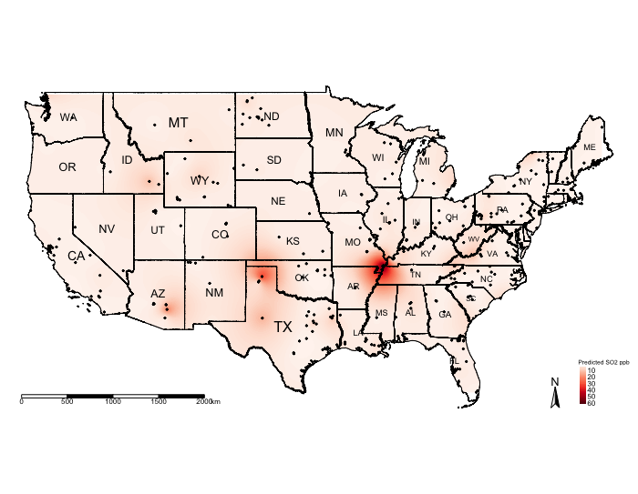
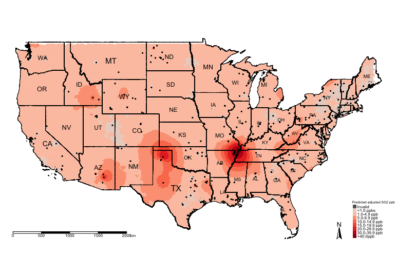

<style type: "text/css">
h1.title {
	font-size: 20px;
}

h4.date {
	font-size: 18px;
}

h1 {
	font-size: 18px;
}

h2 {
	font-size: 18px;
}

body{/* Normal */
	font-size: 13px;
	text-align: justify;
}

p.comment {
background-color: #DBDBDB;
padding: 10px;
border: 1px solid black;
border-radius: 5px;
}

code.r{
  font-size: 10px;
}
pre {
  font-size: 12px
}
</style>

<hr style="border:2px solid gray"> </hr>

```{r setup, include = FALSE}
knitr::opts_knit$set(root.dir = "/Users/anwarmusah/Documents/GITHUB/GEOG0114-PSA-WK6-1/Dataset")
knitr::opts_chunk$set(cache = TRUE)
```

```{r, include = FALSE}
library("gstat")
library("sf")
library("tmap")
library("raster")
library("sp")
```

## **3.1. Building the Raster Template**
Let us create a template raster for interpolation. The extent of the raster template should based on the points. We are going
to make the resolution of grid be at 5000m by 5000m (5km by 5km) accordingly.

```{r eval=FALSE}
RasterTemplate <- raster(datafile_sp_prj)
res(RasterTemplate) <- 5000
```

Next, declare template as a spatial grid
```{r, eval=FALSE}
grid.interpolation <- as(RasterTemplate, 'SpatialGrid')
```

## **3.2. Spatial Interpolation using Kriging**
Now, we are going to use the parameters from the exponential theoretical semivariogram model to interpolate the concentrations of ambient SO2 for the entire study region

```{r, eval=FALSE}
modelKrigingExp <- gstat(formula = Mean_SO2~1, locations = datafile_sp_prj, model = exp_SO2_emp.variogram)
```

The results are stored in `modelKrigingExp` object. Lets add the results of the interpolation to our grid template using the 
`predict()` function

```{r, eval=FALSE}
# this may take roughly 5mins
Kriged_SO2 <- predict(modelKrigingExp, grid.interpolation)
```

The above analysis produces two separate rasters: i.) Predicted $SO_{2}$ and ii.) Variation in $SO_{2}$. Let export the results and make some visualisation using the `tmap` functions

## **3.3. Export the results as .tiff format and Thematic visualisation in** `tmap`
Save both the prediction and variance a multi-layer raster (a 'brick' raster):

```{r, eval=FALSE}
brickedKriged_SO2_Results <- brick(Kriged_SO2)
```

We can save them individually from the multi-layer raster as follows:
```{r, eval=FALSE}
# Separate the rasters accordingly
exp.prediction <- raster(brickedKriged_SO2_Results, layer = 1)
exp.variance <- raster(brickedKriged_SO2_Results, layer = 2)
#  save the output locally on your computer
writeRaster(exp.prediction, "Predicted SO2 levels in USA.tif", format="GTiff", overwrite = TRUE)
writeRaster(exp.variance, "Variance SO2 levels in USA.tif", format="GTiff", overwrite = TRUE)
```

Let us visualise the predictions:
```{r, eval=FALSE}
# mask values of raster outside regions of US Border
US_Nation_Border_sp_shp <- as(US_Nation_Border_shp, "Spatial")
exp.prediction_masked <- mask(exp.prediction, US_Nation_Border_shp)

tm_shape(US_Nation_Border_shp) + tm_polygons(alpha = 0, border.col = "black") + # add base map of borders here
	tm_shape(exp.prediction_masked) + tm_raster(title = "Predicted SO2 ppb", style = "cont", palette = "Reds") +
	tm_shape(US_State_Borders_shp) + tm_polygons(alpha = 0, border.col = "black") +
	tm_text("STUSPS", size = "AREA") +
	tm_shape(datafile_sf_prj) + tm_dots() + 
	tm_scale_bar(position = c("left","bottom")) +
	tm_compass(position = c("right", "bottom")) +
	tm_layout(frame = FALSE, legend.title.size = 0.5, legend.text.size = 0.5)
```

<center>

</center>

The above shows the predicted concentrations of ambient $SO_{2}$; however, the predicted surface is very smooth and it difficult
to see the spatial patterns. One technique, which is sometimes useful, for raster data is to reclassify the pixels to zones instead
of pixel-point estimates.

We could reclassify the continuous values stored in the grids/pixels into discrete values using the following scheme:

- 0 = `"< 1.0 ppb"`
- 1 = `"1.0-4.9 ppb"`
- 2 = `"5.0-9.9 ppb"`
- 3 = `"10.0-14.9 ppb"`
- 4 = `"15.0-19.9 ppb"`
- 5 = `"20.0-29.9 ppb"`
- 6 = `"30.0-39.9 ppb"`
- 7 = `"+40.0 ppb"`

You can do this by using following code:

```{r, message=FALSE, warning=FALSE}
# Create a vector for the reclassification -i.e., 1st row captures values between 0 and below 1 to reclassify a pixel as 0
# the 2nd row in this vector captures values between 1 and below 5 to reclassify a pixel as 1 and so on and so forth
reclassifyRaster <- c(0,1,0,
1,5,1,
5,10,2,
10,15,3,
15,20,4,
20,30,5,
30,40,6,
40,70,7)

# Then store the values into a matrix 
reclassifyRaster_Mat <- matrix(reclassifyRaster, ncol=3, byrow=TRUE)
reclassifyRaster_Mat
```

Now, apply the matrix to the raster object to reclassify the pixels accordingly using the `reclassify()` function:
```{r, eval=FALSE}
exp.prediction_masked_rec <- reclassify(exp.prediction_masked, reclassifyRaster_Mat)
```

Now, lets visualise the zones:
```{r, eval=FALSE}
tm_shape(US_Nation_Border_shp) + tm_polygons(alpha = 0, border.col = "black") + # add base map of borders here
	tm_shape(exp.prediction_masked_rec) + tm_raster(title = "Predicted SO2 ppb", style = "cat", palette = "Reds", 
					 labels = c("<1.0 ppbs","1.0-4.9 ppb","5.0-9.9 ppb", "10.0-14.9 ppb" , "15.0-19.9 ppb", "20.0-29.9 ppb", "30.0-39.9 ppb","+40.0ppb")) +
	tm_shape(US_State_Borders_shp) + tm_polygons(alpha = 0, border.col = "black") +
	tm_text("STUSPS", size = "AREA") +
	tm_shape(datafile_sf_prj) + tm_dots() + 
	tm_scale_bar(position = c("left","bottom")) +
	tm_compass(position = c("right", "bottom")) +
	tm_layout(frame = FALSE, legend.title.size = 0.5, legend.text.size = 0.5)
```

<center>

</center>

You can visualise the variance:
```{r, eval=FALSE}
# mask values of raster outside regions of US Border
exp.variance_masked <- mask(exp.variance, US_Nation_Border_sp_shp)

tm_shape(US_Nation_Border_shp) + tm_polygons(alpha = 0, border.col = "black") + # add base map of borders here
	tm_shape(exp.variance_masked) + tm_raster(title = "Variance SO2 ppb", style = "cont", palette = "Reds") +
	tm_shape(US_State_Borders_shp) + tm_polygons(alpha = 0, border.col = "black") +
	tm_text("STUSPS", size = "AREA") +
	tm_shape(datafile_sf_prj) + tm_dots() + 
	tm_scale_bar(position = c("left","bottom")) +
	tm_compass(position = c("right", "bottom")) +
	tm_layout(frame = FALSE, legend.title.size = 0.5, legend.text.size = 0.5)
```

<center>

</center>

<p class="comment">
**IMPORTANT NOTES**: The above example was a null model. We can include risk factors as adjustments for the prediction. The below code shows you how to incorporate other variables in the analysis. We will use the other raster data sets for urbanisation, deprivation and car usage as adjustments in the Kriging model.
</p>

## **3.4. Kriging with Regression**

```{r, eval = FALSE}
# CORRECTIONS APPLIED

library("sf")
library("sp")
library("raster")
library("tmap")
library("gstat")
library("geoR")

datafile <- read.csv(file = "US 2019 SO2 Emissions data.csv", header=TRUE, sep=",")

US_Nation_Border_shp <- st_read("US Nation Border.shp")
US_State_Borders_shp <- st_read("US State Borders.shp")

# Coerce the spreadsheet into a sf object
# First tell R that it’s coordinates are currently in decimal degrees (i.e., WGS84 'crs = 4326') before the transformation
datafile_sf <- st_as_sf(datafile, coords = c("Longitude", "Latitude"), crs = 4326)
# Now apply the transformation from WGS84 to Mercator i.e., = 3857
datafile_sf_prj <- st_transform(datafile_sf, 3857)
# Inspect the details
st_crs(datafile_sf_prj)

# Step 1: Load rasters. These are the covariates we will use in the gstat() function for the kriging regression
US_urbanisation <- raster("US Urbanisation Index 5km.tif")
US_SVI <- raster("US Socioeconomic Deprivation 5km.tif")
US_CarUsage <- raster("US Prevalence of Car Usage 5km.tif")
# ignore that stupid warning message as its related to outdated 'rgdal & rgeos'. All raster are in the CRS Mercator 3857

# Step 2: Stack the three rasters together by using the stack() function 
predictors <- stack(US_urbanisation, US_SVI, US_CarUsage)

# Step 3: from the stacked data extract the raster values on the points of pollution stations using the extract() function
predictors.values <- extract(predictors, datafile_sp_prj)

# Step 4: Stitch the extraction to the spatial point data frame using the cbind() "column bind" function
datafile_sp_prj@data <- cbind(datafile_sp_prj@data, predictors.values)

# You can view the dataframe to see the raster values. What has happened is we extracted the overlapping raster pixels on
# those pollution stations and assuming those are the levels of urbanisation, deprivation and car usage at those points for
# which the SO2 levels are observed. 
View(datafile_sp_prj@data)

# Step 5: Linear Regression model to determine which variables are worth to be included in the Kriging model. If the turn out
# to be statistical significant (i.e., p < 0.05). Then include to include in the kriging.
lm.model <- lm(Mean_SO2 ~ US_Urbanisation_Index_5km + US_Socioeconomic_Deprivation_5km + US_Prevalence_of_Car_Usage_5km, data = datafile_sp_prj@data)
summary(lm.model)

# all variables are statistically significant. According to this model urbanisation and car usage marginally decreases SO2 levels,
# while areas of higher deprivation yields higher levels of SO2. Include all variables to the Kriging model since they are
# significant.

# Step 6: use variogram() function to compute the semivariance with variable in the model
SO2_adj_emp.variogram <- variogram(Mean_SO2 ~ US_Urbanisation_Index_5km + US_Socioeconomic_Deprivation_5km + US_Prevalence_of_Car_Usage_5km, datafile_sp_prj)
SO2_adj_emp.variogram
plot(SO2_adj_emp.variogram)

# Step 7: Determine best model
best_SO2_adj_emp.variogram <- fit.variogram(SO2_adj_emp.variogram, model = vgm(c("Exp", "Gau", "Sph")))
best_SO2_adj_emp.variogram
plot(SO2_adj_emp.variogram, best_SO2_adj_emp.variogram, main = "Best Model: Exponential (Nug: 5.63, PSill: 49.4, Range: 293891.2m)")

# HERE ARE THE CORRECTIONS
# Step 8: Here is where we need to insert the raster values and not the points. In the previous iteration, I mistakenly used the
# point verison of the car usage data and adapted the code without verifying it to work. I sincerely apologise for this oversight!
modelKrigingExp_adj <- gstat(formula = Mean_SO2~US_Urbanisation_Index_5km + US_Socioeconomic_Deprivation_5km + US_Prevalence_of_Car_Usage_5km, locations = datafile_sp_prj, model = best_SO2_adj_emp.variogram)

# Take the stacked rasters for car usage, urbanisation and socioeconomic deprivation and convert it to a grid template
# Here, we need their values stored inside that grid template, to which we will apply the kriging model to make the prediction
# while at the same time make adjustments for their value.

# we created the stacked into the 'predictors' object
predictors.grid <- as(predictors, "SpatialGridDataFrame")

# Last time it was just "SpatialGrid" because it was empty. This grid has values and thus not empty 
# so we call it "SpatialGridDataFrame"

# Step 9: We can now do the predictions over the SpatialGridDataFrame
Kriged_SO2_adj <- predict(modelKrigingExp_adj, predictors.grid)

# Brick the layer in order to separate the estimated prediction and variance accordingly
brickedKriged_SO2_Results_adj <- brick(Kriged_SO2_adj)
exp.prediction_adj <- raster(brickedKriged_SO2_Results_adj, layer = 1)
exp.variance_adj <- raster(brickedKriged_SO2_Results_adj, layer = 2)

# Step 10: Masking the prediction and reclassifying the layer
# You can mask the prediction with the outline of USA
US_Nation_Border_sp_shp <- as(US_Nation_Border_shp, "Spatial")
exp.prediction_adj_masked <- mask(exp.prediction_adj, US_Nation_Border_sp_shp)

# Run this to see minimum and maximum value.
exp.prediction_adj_masked

# You can see there are negative value as some of the prediction for SO2. 
# Lets reclassify these as an invalid prediction with value -1
reclassifyRaster <- c(-2,0,-1, 
0,1,0,
1,5,1,
5,10,2,
10,15,3,
15,20,4,
20,30,5,
30,40,6,
40,70,7)

reclassifyRaster_Mat <- matrix(reclassifyRaster, ncol=3, byrow=TRUE)
reclassifyRaster_Mat

# Apply the categories to masked layer in order to reclassify the predictions that were adjusted those 3 variables
exp.prediction_adj_masked_rec <- reclassify(exp.prediction_adj_masked, reclassifyRaster_Mat)
# Create the labels for the 'reclassifyRaster_Mat" object
SO2LevelsCategories <- c("Invalid","<1.0 ppbs","1.0-4.9 ppb","5.0-9.9 ppb", "10.0-14.9 ppb" , "15.0-19.9 ppb", "20.0-29.9 ppb", "30.0-39.9 ppb","+40.0ppb")

# Finally, we going to force the colour schemes we want. 
# We want the "Invalid" category to have a grey colour; and the rest for lowest category
# ie., "<1.0ppbs" to "+40.0ppb" to be increase red intensities"

# Force the colorbrewer schemes grey = #636363
# Force the reds (from light red down to solid-dark-red) = #fee5d9, #fcbba1, #fc9272, #fb6a4a, #ef3b2c, #cb181d, #99000d

# Create the colour scheme for the above 'SO2LevelsCategories'
HackedColourPalette <- c("#636363", "#fee5d9", "#fcbba1", "#fc9272", "#fb6a4a", "#ef3b2c", "#cb181d", "#99000d")

# Step 11: Visual the adjusted prediction from Universal Kriging Regression
tm_shape(US_Nation_Border_shp) + 
	tm_polygons(alpha = 0, border.col = "black") + # add base map of borders here
	tm_shape(exp.prediction_adj_masked_rec) + 
	tm_raster(title = "Predicted adjusted SO2 ppb", style = "cat", palette = HackedColourPalette, labels = SO2LevelsCategories) +
	tm_shape(US_State_Borders_shp) + tm_polygons(alpha = 0, border.col = "black") +
	tm_text("STUSPS", size = "AREA") +
	tm_shape(datafile_sf_prj) + tm_dots() + 
	tm_scale_bar(position = c("left","bottom")) +
	tm_compass(position = c("right", "bottom")) +
	tm_layout(frame = FALSE, legend.title.size = 0.5, legend.text.size = 0.5)
```

<center>

<center>

<hr style="border:2px solid gray"> </hr>
