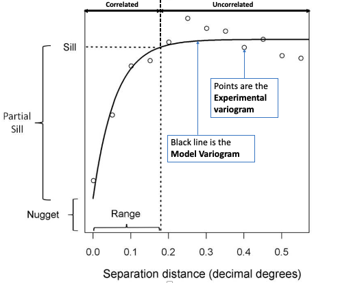

 

## **2.1. Semivariogram analysis**
Semivariograms describe how data are related with distance by plotting the **semivariance** against the **separation distance**, known as the experimental semivariogram. The semivariance is defined as half the average squared difference between points separated by some distance _h_. As the separation distance _h_ between samples increase, we would expect the semivariance to also increase (again, because near samples are more similar than distant samples).

In the generic semivariogram shown above, there are three important parameters: 

1. **Sill**: The maximum semivariance value observed, and it indicates the threshold for values beyond (i.e., flatline) which
there is no spatial autocorrelation. **NOTE**: the **Partial Sill** is a value calculated by taking the difference between 
the **Sill** and **Nugget** (i.e., **Partial Sill = Sill - Nugget**)
2. **Range**: The maximum separation distance _h_ at which we will expect to find evidence of spatial autocorrelation. A 
separation distance beyond the **range** samples are no longer correlated. 
3. **Nugget**: This describes the variance of the measurement error combined with spatially uncorrelated variations at distances
shorter than the sample spacing, namely noise in the data. The larger the **nugget** relative to the **sill**, the less spatial 
dependence there is in the data and less useful Kriging will be.

**IMPORTANT NOTES**: Two important assumptions of a basic semivariogram are that the spatial process under investigation are: i.)
**stationary**, i.e., the spatial autocorrelation between the measurements of same variables in a given area is the same for all
locations; and ii.) **isotropic**, spatial autocorrelation is the same in every direction. If the autocorrelation differs by direction, it is termed as **anisotropic**.

