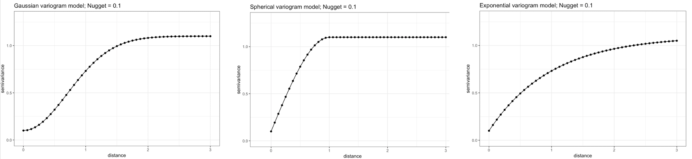
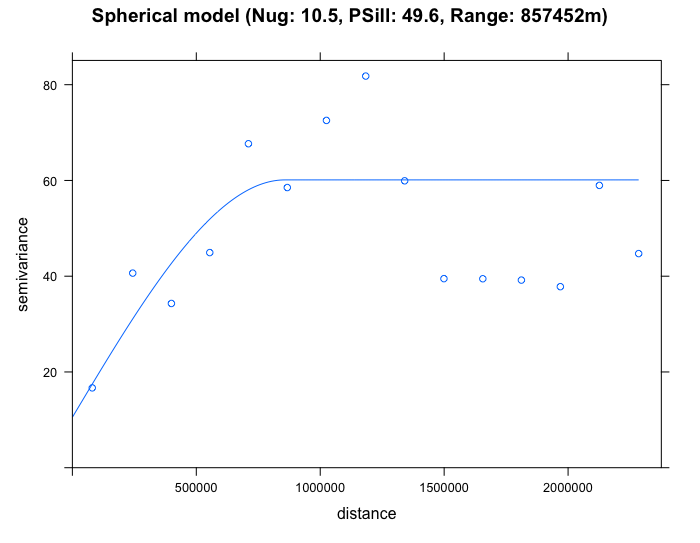

<style type: "text/css">
h1.title {
	font-size: 20px;
}

h4.date {
	font-size: 18px;
}

h1 {
	font-size: 18px;
}

h2 {
	font-size: 18px;
}

body{/* Normal */
	font-size: 13px;
	text-align: justify;
}

p.comment {
background-color: #DBDBDB;
padding: 10px;
border: 1px solid black;
border-radius: 5px;
}

code.r{
  font-size: 10px;
}
pre {
  font-size: 12px
}
</style>

<hr style="border:2px solid gray"> </hr>

```{r setup, include = FALSE}
knitr::opts_knit$set(root.dir = "/Users/anwarmusah/Documents/GITHUB/GEOG0114-PSA-WK6-1/Dataset")
knitr::opts_chunk$set(cache = TRUE)
```

```{r, include = FALSE}
library("gstat")
library("sf")
library("tmap")
library("raster")
library("sp")
```

## **2.1. Semivariogram analysis**
Semivariograms describe how data are related with distance by plotting the **semivariance** against the **separation distance**, known as the **experimental** or **empirical semivariogram**. The semivariance is defined as half the average squared difference between points separated by some distance _h_. As the separation distance _h_ between samples increase, we would expect the semivariance to also increase (again, because near samples are more similar than distant samples).

<center>


</center>

In the generic semivariogram shown above, there are three important parameters: 

1. **Sill**: The maximum semivariance value observed, and it indicates the threshold for values beyond (i.e., flatline) which
there is no spatial autocorrelation. **NOTE**: the **Partial Sill** is a value calculated by taking the difference between 
the **Sill** and **Nugget** (i.e., **Partial Sill = Sill - Nugget**)
2. **Range**: The maximum separation distance _h_ at which we will expect to find evidence of spatial autocorrelation. A 
separation distance beyond the **range** samples are no longer correlated. 
3. **Nugget**: This describes the variance of the measurement error combined with spatially uncorrelated variations at distances
shorter than the sample spacing, namely noise in the data. The larger the **nugget** relative to the **sill**, the less spatial 
dependence there is in the data and less useful Kriging will be.

<p class="comment">
**IMPORTANT NOTES**: Two important assumptions of a basic semivariogram are that the spatial process under investigation are: i.)
**stationary**, i.e., the spatial autocorrelation between the measurements of same variables in a given area is the same for all
locations; and ii.) **isotropic**, spatial autocorrelation is the same in every direction. If the autocorrelation differs by direction, it is termed as **anisotropic**.
</p>

To be used in Kriging, a semivariogram plot (akin to the above image) must be generated to estimate the 3 parameters (i.e., sill, nugget & range) from the points termed **experimental** or **empirical semivariogram**. These are used as initial values to fit a **modelled** or **theoretical semivariogram** which can be in one of three major forms:
1. Gaussian Model (Left)
2. Spherical Model (Center)
3. Exponential Model (Right)

</br>

<center>

</center>

</br>

Once the modelled semivariogram has been defined, it can be used in Kriging. 

</br>

## **2.2. Plotting the Empirical Semivariogram**
Use the function `variogram()` to create the object for plotting the empirical variogram

```{r, message=FALSE,warning=FALSE}
# coerce datafile_sf_prj to be a 'sp' spatial dataframe object as it variogram does not use 'sf' objects
# ignore warning message
datafile_sp_prj <- as(datafile_sf_prj, "Spatial")
# use variogram() function to compute the semivariance with a null model Mean_SO2 as outcome
SO2_emp.variogram <- variogram(Mean_SO2~1, datafile_sp_prj)
# Compute the object to reveal a table
SO2_emp.variogram
```

<p class="comment">
**IMPORTANT NOTES**: `np` in the output is the number of paired considered within the separation distance `dist`; `gamma` is the averaged semivariance for the number of paired points within the separation distance `dist`.
</p>

</br> 

Let us plot these values to see the empirical semivariogram
``` {r, eval = FALSE}
plot(SO2_emp.variogram)
```

<center>

</center>

From the output (i.e., plot and table), we should note the approximate values for the `partial sill`, `nugget` and `range`. 
1. The `nugget` is roughly **17** (i.e. base on starting `gamma` value from the table).
2. The `range` is roughly **1180000** meters (i.e. base on peak value for `gamma` and it's corresponding `dist`).
3. The `partial sill` is **65**. This is derived from the peak value for `gamma` subtracted by the `nugget` (`82 - 17 = 65`).

These initial values give us an idea of what to expect when we proceed to fit a **theoretical** semivariogram using the `fit.variogram()`. It will help us to generate the fitted models.

</br>

## **2.3. Plotting the Theoretical Semivariogram**
We are going to fit a model to the empirical semivariogram in order to determine the appropriate function for Kriging (i.e., spherical (`Sph`), exponential (`Exp`) or gaussian (`Gau`)). 

We will start fitting the various models:

```{r, eval=FALSE}
# Fit exponential
exp_SO2_emp.variogram <- fit.variogram(SO2_emp.variogram, model = vgm(65, "Exp", 1180000, 17))
exp_SO2_emp.variogram
plot(SO2_emp.variogram, exp_SO2_emp.variogram, main  = "Exponential model (Nug: 3.6, PSill: 55.9, Range: 296255m)")
```

<center>

</center>

```{r, eval=FALSE}
# Fit Spherical
sph_SO2_emp.variogram <- fit.variogram(SO2_emp.variogram, model = vgm(65, "Sph", 1180000, 17))
sph_SO2_emp.variogram
plot(SO2_emp.variogram, sph_SO2_emp.variogram, main  = "Spherical model (Nug: 10.5, PSill: 49.6, Range: 857452m)")
```

<center>

</center>

```{r, eval=FALSE}
# Fit gaussian
gau_SO2_emp.variogram <- fit.variogram(SO2_emp.variogram, model = vgm(65, "Gau", 1180000, 17))
gau_SO2_emp.variogram
plot(SO2_emp.variogram, gau_SO2_emp.variogram, main  = "Gaussian model (Nug: 12.8, PSill: 39.1, Range: 244807m)")
```

<center>

</center>

By eyeballing the images - it difficult to discern whether the exponential or spherical model provides a better fit to the empirical semivariogram. We can use the `fit.variogram()` function to determine which is the best model amongst them. 

```{r, message=FALSE, warning=FALSE}
# select the best model
best_SO2_emp.variogram <- fit.variogram(SO2_emp.variogram, model = vgm(c("Exp", "Gau", "Sph")))
best_SO2_emp.variogram
```

From the output (see column which says `model` and `row 2` it highlights `"Exp"`), it shows that the exponential model is the best fit with a `nugget = 3.6`, `Partial Sill =  55.9` and `Range = 296255m`. We therefore select the exponential model in our Kriging to make the spatial prediction for $SO_{2}$. Lets proceed to Krige. 

<center>

</center>

<p class="comment">
**IMPORTANT NOTES**: The interpretation is as follows: the `nugget` in the exponential model is smaller than the other proposed models. It is small which is also an indication of evidence of larger spatial dependence in the concentrations for $SO_{2}$ across sampling sites in USA; A separation distance with values beyond `296255m` (where it curve starts to plateau) and beyond the semivariance's threshold where it flat lines (sill of `59.5` (i.e., `55.9 + 3.6`)) - there should expect that the spatial autocorrelation in the observed levels of $SO_{2}$ are not present anymore.
</p>

<hr style="border:2px solid gray"> </hr>